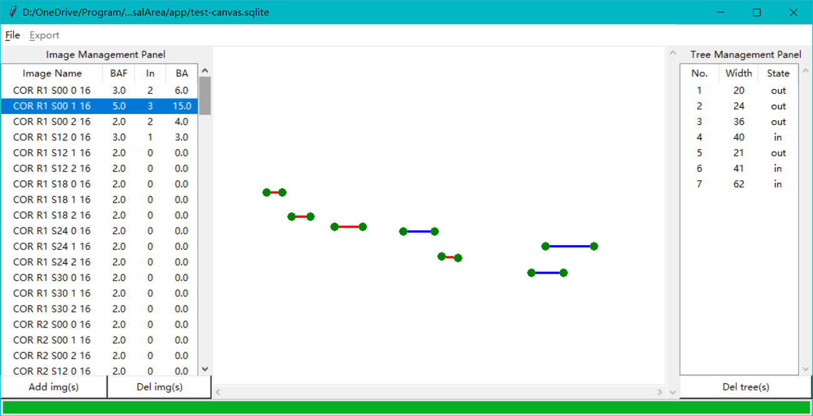

# Panorama2BasalArea
Calculate forest BA values from spherical(panorama) images by manual tree selection.

## Backgrounds
**Basal area** is the area of a given section of land that is occupied by the cross-section of tree trunks and stems at the base

An **Angle gauge** is a tool used by foresters to determine which trees to measure when using a variable radius plot design in forest inventory. Using this tool a forester can quickly measure the trees that are in or out of the plot

To be more specific, the angle gauge does the thing like this:

If a tree exceed the given angle, it is counted as "in" tree, the Basal Area (BA) can be simply calculated by:
BA = in tree num * BAF, where BAF is basal area factor determined by angle size. 

If we have a panorama photo in forest like this:

it can be simplified by counting the tree pixel width to determine whether it is "in" or "out", 
that is the reason why we develop this software.

## Main functions:
1. project management based on sqlite database.
1. import single image and all images in one folder (and its child folders) whose name contain given keywords
1. image photo brightness equalization to show more details in overexposed and underexposed regions
1. image zoom in and out to get more details
1. tree management
    * add trees
    * edit trees
    * delete trees
1. export result excel files

## Operations
### 1. Project management
1. `File` > `New`: create a new project (`Ctrl` + `N`)
1. `File` > `open`: open a former project (`Ctrl` + `O`)
1. `File` > `save`: save changes to current project (`Ctrl` + `S`)
1. `File` > `export`: export results to a excel file

### 2. Image management

1. `Add img`: add spherical image to this project
    Dialog: Add by folder? [Yes/No/Cancel]
    * `Yes`: select folder first, then type keywords in image name need to import.
        * `*`or leaving blank ` ` is importing all images (default)
        * keywords need split by `;`
    * `No`: select a single spherical image to import
1. `Del img`: remove the selected image from this project
    **Warning**: this operation will also delete all tree records in this image as well.
1. `left-click` on image name: show this image and its trees information
1. `double-click` on image name: change default BAF value of this image (default is 2)
1. `double-right-click` on image name: change all images' default BAF values at once.

### 3. Tree management
1. Add trees
    1. `ctrl` + `mousewhell`: zoom images to proper size
    1. Press `Space` switching to adding tree mode (cursor will change to +)
    1. `left-click` to add the first point of tree boundary
    1. `move` to another boundary, `left-click` for another boundary point
        * if the line between two points color is **red**, currently is **out** tree
        * if line color is **blue**, it is a **in** tree
        * default, the line is locked to be horizontal
        * press `shift` to unlock and create lines for leaned trees
2. Edit trees
    1. `left-click` the tree record, the image will center this tree line
    1. drag the boundary point to change position (hold `shift` for leaned tree)
3. Delete trees
    1. select the tree record and press `delete`
    1. a delete confirmation dialog will appear

### 4. Other Shortcuts
1. `mousewheel`: scroll image vertically
1. `alt` + `mousewheel`: scroll image horizontally

## Updates
All the previous functions mentioned above is still under construction ^_^