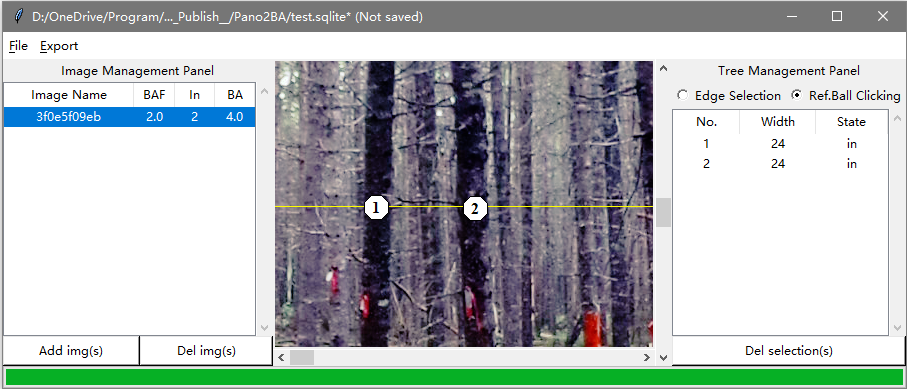

# Panorama2BasalArea

Calculate forest BA values from spherical(panorama) images by manual tree selection.

## Backgrounds
**Basal area** is the area of a given section of land that is occupied by the cross-section of tree trunks and stems at the base

An **Angle gauge** is a tool used by foresters to determine which trees to measure when using a variable radius plot design in forest inventory. Using this tool a forester can quickly measure the trees that are in or out of the plot

To be more specific, the angle gauge does the thing like this:

If a tree exceed the given angle, it is counted as "in" tree, the Basal Area (BA) can be simply calculated by:
BA = in tree num * BAF, where BAF is basal area factor determined by angle size. 

If we have a panorama photo in forest like this:

it can be simplified by counting the tree pixel width to determine whether it is "in" or "out", 
that is the reason why we develop this software.

## Main functions:
1. project management based on sqlite database.
1. import single image and all images in one folder (and its child folders) whose name contain given keywords
1. image photo brightness equalization to show more details in overexposed and underexposed regions
1. image zoom in and out to get more details
1. tree management
    * add trees
    * edit trees
    * delete trees
1. export result excel files

## Operations
### 1. Project management
1. `File` > `New`: create a new project (`Ctrl` + `N`)
1. `File` > `open`: open a former project (`Ctrl` + `O`)
1. `File` > `save`: save changes to current project (`Ctrl` + `S`)
1. `File` > `export`: export results to a excel file
    * `Default BAF`: Export BA results based on each image defined BAF
    * `BAF sequence`: Export different BA results on each image for several given BAFs, the BAF sequence is generated by
     users inputting the start, end, and step values, e.g. (st=1, ed=3, step=0.5) will give a BAF sequence \[1, 1.5, 2, 2.5, 3\]
    

### 2. Image management
1. `Add img`: add spherical image to this project
    * `Yes`: select folder first, then type keywords in image name need to import.
        * `*` or leaving blank is importing all images (default)
        * keywords need split by `;` or by space ` `
        * `-` before a keyword (e.g. -X) mean ignore images contain 'X'
    * `No`: select a single spherical image to import
1. `Del img`: remove the selected image from this project
    **Warning**: this operation will also delete all tree records in this image as well.
1. `left-click` on image name: show this image and its trees information
1. `right-click` on image name: change default BAF value of this image (default is 2)
    
1. `mouse-wheel-click` on image name: change all images' default BAF values at once.

### 3. Tree management

This software has two different tree marking modes (Edge Marking and Target Count):

Two different mode can be switched by clicking the Tree Management Panel:

1. Add trees

    1. `ctrl` + `mousewhell`: zoom images to proper size, the software title will tell you current zoom ratio, 
        release `ctrl` to finish zoom in)

    1. Press `Space` switching to adding tree mode (cursor will change to +)

    1. Press `r` to display/hide a minimum tree reference bar (baf=1.0) hover mouse to determine current tree should add or not

	**---Edge Marking Mode---**

    1. `left-click` to add the first point of tree boundary
    
    1. `move` to another boundary, `left-click` for another boundary point
       
        * if the line between two points color is **red**, currently is **out** tree
        * if line color is **blue**, it is a **in** tree
        * default, the line is locked to be horizontal
        * press `shift` to unlock and create lines for leaned trees

    
    
    **---Target Counting Mode---**
    `left-click` to mark those tree bigger than reference octagon
    

2. Edit trees
    
    **---Edge Mode---**

    1. `left-click` the tree record, the image will center this tree line
1. drag the boundary point to change position (hold `shift` for leaned tree)
    
    
    
    **---Target Mode---**
    
    Click and Drag Directly
    
    
    
3. Delete trees
    1. select the tree record and press `delete`
    1. a delete confirmation dialog will appear

    

## Updates
Beta1.0: Finish all functions mentioned above 